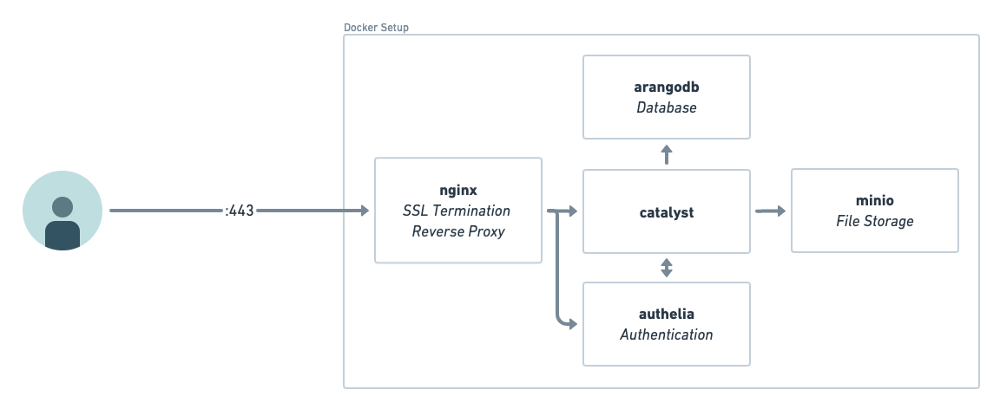
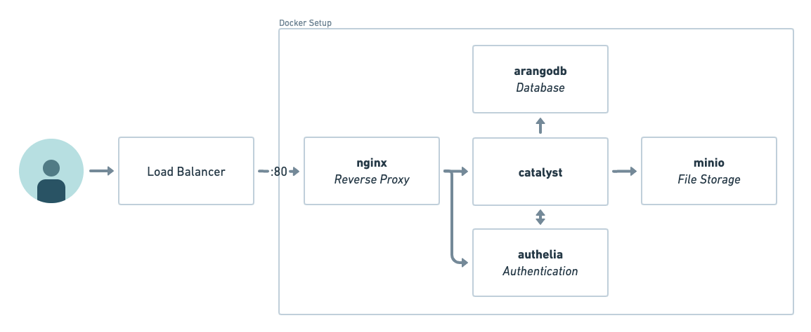

import Tabs from '@theme/Tabs';
import TabItem from '@theme/TabItem';

# Install

:::tip

If you just want to try Catalyst you can also use the [demo](/demo).

:::

There are many ways to install Catalyst. The following describes a reference architecture on an Ubuntu 22.04 server.
It is also used in the [demo](/demo) environment.
Feel free to adapt it to your needs.

<Tabs>
<TabItem value="default" label="Reference Architecture" default>



</TabItem>
<TabItem value="no-ssl" label="Reference Architecture with Load Balancer / Proxy">



</TabItem>
</Tabs>

## Installation Script

The installation script will create secrets and set up a `docker compose` deployment.
It is tested on Ubuntu 22.04 but should work on other Linux distributions and macOS as well.

### Installation Process

1. Set up 2 new (sub)domains, one for catalyst and one for authelia (OIDC user management).
2. Set up the catalyst server.
   1. Set up a Ubuntu 22.04 server.
   2. Point the domains from step 1 to the server.
   3. Ensure [Docker](https://docs.docker.com/engine/install/),
      [Docker Compose](https://docs.docker.com/compose/install/),
      `unzip`, `curl`, `openssl`, and `sed` are installed.
   4. Download the installation script:
      `curl -sL https://raw.githubusercontent.com/SecurityBrewery/catalyst-setup/v0.10.3/install_catalyst.sh -o install_catalyst.sh`
   5. Adapt the command to your needs:
      ```bash
      bash install_catalyst.sh \
        <hostname> \
        <authelia_hostname> \
        [<ssl_certificate> <ssl_certificate_key> | --no-ssl] \
        <admin-user:admin-password:admin-email> \
        <user:password:email> ...
      ```
      1. `hostname` is the domain name of the catalyst server, e.g. `https://try.catalyst-soar.com`
      2. `authelia_hostname` is the domain name of the authelia server, e.g. `https://authelia-try.catalyst-soar.com`
      3. `ssl_certificate` and `ssl_certificate_key` are the paths to the SSL certificate and key.
         If you handle ssl termination at a load balancer or reverse proxy, you can use `--no-ssl` to disable SSL.
      4. `admin-user:admin-password:admin-email` is the admin user that will be created.
      5. `user:password:email` are the users that will be created.
         You can add as many users as you want, but also add them later.
   6. Run the command, e.g.:
      ```bash
      bash install_catalyst.sh \
        https://try.catalyst-soar.com \
        https://authelia-try.catalyst-soar.com \
        --no-ssl \
        admin:admin:admin@example.com \
        alice:alice:alice@example.com \
        bob:bob:bob@example.com
      ```
   7. Wait for the installation to finish. Catalyst will be available at `<hostname>`.
   8. Log in with the credentials from above.

## User Management

Users are managed by [Authelia](https://www.authelia.com/).
The `user_database.yml` file is located at `authelia/user_database.yml`.

You can also use other OIDC providers like [Keycloak](https://www.keycloak.org/).
Adjust the `OIDC_*` environment variables in the `docker-compose.yml` file and remove the `authelia` service if you want
to do that.

## Self-Signed Certificates

If you want to use self-signed certificates and an external OIDC provider you might need to add them to the catalyst
container, so that it trusts the connection to the OIDC provider.

```yaml
…
catalyst:
  volumes:
    - "./mycert.crt:/etc/ssl/certs/mycert.crt:ro"
    - "./myroot.crt:/etc/ssl/certs/myroot.crt:ro"
  …
```
